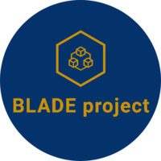

# BLADE project - BLockchain Automated DEcision process

<div align="center">
  
  <p>
    The BLADE project aims to help companies choose between available blockchains.
    <br/>
    From a set of requirements, this automated process will compute the most desirable blockchain alternative for your project.
  </p>
  <br/>
</div> 

*Disclaimer: This project is currently on its premises, as only a few alternatives and attributes are available.*

Welcome to the BLADE project! Carried by a team of researchers at the CRI (Centre de Recherche en Informatique) of Université Paris 1 Panthéon-Sorbonne, this tool aims to help making decisions regarding which blockchain to use, based on requirements.

## Direct access

If you want to try the BLADE project online, a live demo is available on [this website](https://recommender.blade-blockchain.eu/) (current version: _1.2.0_)! 

## Quick start

The Makefile at the root of this project automatically deploy two containers: one for the API, and one for the frontend. To deploy, make sure you have Docker installed on your machine, then type:
```
make build && make run
```
You can also stop and delete Docker images of the containers, by typing this command:
```
make stop
```

## Manual installation

If you prefer, you can start the two services without using Docker, manually. Follow the next two tutorials to do so.

### Start the API
1. Go into the _blade/api_ folder.
2. Make sure that Python3 is installed, as well as pip.


```bash

sudo apt-get install python3.6

sudo apt-get install python3-pip

```

3. We recommand you to create a virtual environment for your project. To do that, proceed as follows:

```bash

sudo apt-get install python3-venv

python3 -m venv .venv

source .venv/bin/activate

```

4. Then, install all required pip packages:

  

```bash

pip install -r requirements.txt

```

5. This project needs MongoDB to work. MongoDB is a NoSQL cross-platform document-oriented database program, working using JSON files as documents. PyMongo is already installed thanks to the previous command, but we need to set up the database. Proceed as follows:

```bash

wget -qO - https://www.mongodb.org/static/pgp/server-4.2.asc | sudo apt-key add -

echo  "deb [ arch=amd64,arm64 ] https://repo.mongodb.org/apt/ubuntu bionic/mongodb-org/4.2 multiverse" | sudo tee /etc/apt/sources.list.d/mongodb-org-4.2.list

sudo apt-get update

sudo apt-get install -y mongodb-org

sudo systemctl start mongod

```

*More documentation is available on MongoDB website if needed: https://docs.mongodb.com/manual/tutorial/install-mongodb-on-ubuntu/.*

6. Finally, we have to import the knowledge base from the knowledge-base directory available in this directory:

```bash

mongorestore -d knowledge-base knowledge-base

```

*If this is not working, use a MongoDB editor such as Robo3T or Studio3T, or the MongoDB CLI to create knowledge-base database.*
### Start the frontend
Make sure you have Node.js version 10 or + installed on your computer, then go into the _blade/front_ directory and type:
```
npm install
npm start
```
If your Python API is running, you should be able to use the tool in your browser, at this address: _localhost:3000_.

## Manual decision process execution using manual_solver.py

This tool allows you to make decisions without using the frontend at all if wanted, you can just feed it with a yaml file.

This file contains all the requirements to work. Fortunately, we created one called supplychain.yaml as an example. You can edit the file to set your own requirements or create yours, following this syntax:

```yaml

# This attribute does not have any requirements, just set the weight between 0 and 1, that represents the importance of the criteria in the decision (if it helps you, in our research paper, we use a Likert scale to define the values!)

cryptocurrency:
  weight: 0
  requirements: []

# This attribute does have a requirement. Mandatory indicates that this attribute is required in the decision process and any alternative that does not match with that will be automatically rejected. The value field is the value required.

storageElt:
  weight: 0
  requirements:
    key: mandatory
    value: 0.8

```
  

To run the script from that, simply type:

```bash

python3 manual_solver.py supplychain.yaml

```

## Associated publications

Six, Nicolas. "Decision Process for Blockchain Architectures based on Requirements." CAiSE (Doctoral Consortium). 2020. _(BLADE version tag: 1.2.0)_

Six, Nicolas, Nicolas Herbaut, and Camille Salinesi. "Quelle Blockchain choisir? Un outil d'aide à la décision pour guider le choix de technologie Blockchain." (2020). _(BLADE version tag: 1.0.0)_

## Contact

If you have any questions, feel free to reach us at this address: nicolas.six@univ-paris1.fr!