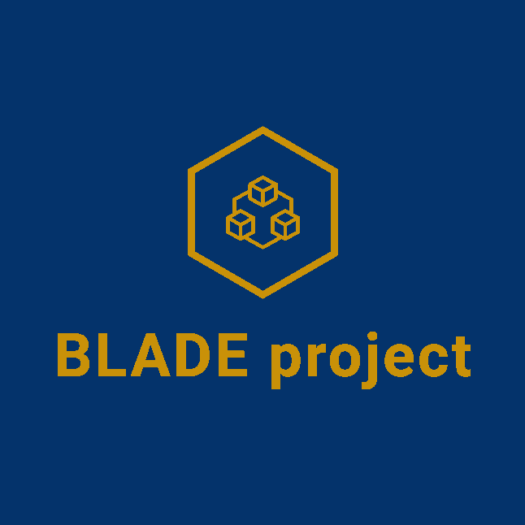

# BLADE project - BLockchain Automated DEcision process

<div align="center">
  
  <p>
    The BLADE project aims to help companies choose between available blockchains.
    <br/>
    From a set of requirements, this automated process will compute the most desirable blockchain alternative for your project.
  </p>
  <br/>
</div> 

*Disclaimer: This project is currently on its premises, as only a few alternatives and attributes are available.*

## Setup

If you want to manually use the decision process, go inside the *blade* folder. However, the following method provides an automatic way of installing the project and use it through a web interface.

1. Install Docker

Please follow the corresponding documentation for your platform on [Docker's](https://docs.docker.com/get-docker/) website.

2. Launch the platform

To launch the platform, simply run in your terminal:

```bash
make build && make run
```

The script will boot up the platform, and you will be able to access it through [localhost](http://localhost:5000). If you want to turn it off, you can use the following command:

```bash
make stop
```

## Associated publications

Six, Nicolas, Nicolas Herbaut, and Camille Salinesi. "Quelle Blockchain choisir? Un outil d'aide à la décision pour guider le choix de technologie Blockchain." (2020). _(BLADE version tag: 1.0.0)_

## Contact

If you have any questions, feel free to reach us at this address: nicolas.six@univ-paris1.fr!
